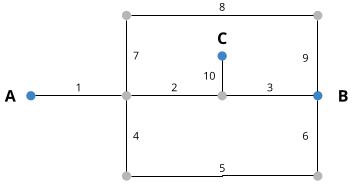

# About the test data

## Road network



| id | length in km | RUC | ROAD_CLASS | AVG_COND |
| --- | --- | --- | --- | --- |
| 1 | 1 | 1.25 | Unpaved | poor |
| 2 | 1 | 1.25 | Unpaved | poor |
| 3 | 1 | 1.25 | Unpaved | poor |
| 4 | 1 | 0.75 | Unpaved | poor |
| 5 | 2 | 0.75 | Unpaved | poor |
| 6 | 1 | 0.75 | Unpaved | poor |
| 7 | 1 | 0.8 | Unpaved | poor |
| 8 | 2 | 0.8 | Unpaved | poor |
| 9 | 1 | 0.8 | Unpaved | poor |
| 10 | 0.5 | 0.8 | Unpaved | poor |

## OD Pairs
The dataset contains 3 points of interest.

### A - B
`A - B` has three potential routes, ordered here from lowest total RUC to highest.

- **Route 1**  
  - Road segments: `1-2-3`
  - Total RUC = $ 3.75
  - Unroutable in return period: 9 and 10
- **Route 2**  
  - Road segments: `1-4-5-6`
  - Total RUC = $ 4.25
  - Unroutable in return period: 10
- **Route 3**  
  - Road segments: `1-7-8-9`
  - Total RUC = $ 4.45
  - Always routable

`A - B` is routable in all return periods.

### A & B - C
`A - C` and `B - C` is unroutable in return period 9 and 10. No EAUL can be calculated.

## Floods
Road segments are generally not flooded, except in the following cases:

- segment 2 has 20 meters in return period 9 and 10
- segment 3 has 20 meters in return period 9 and 10
- segment 5 has 20 meters in return period 10

In return period 9, segment 2 and 3 are 50% flooded. In return period 10, everything is 100% flooded.

## Traffic
Traffic is stable at 100 / day, for all directions on all OD pairs.

# Notes on EAUL

- impact of upgrades on segment 7, 8 and 9 is most significant, as any upgrade will make it the fastest route. This route is also never flooded.
- there is no impact of an upgrade on segment 1 on EAUL, as it doesn't affect routing in any way. The benefit of decrease in RUC is captured by another benefit.
- there is no impact of an upgrade on segment 10, as it's never routable
- segment 2 & 3 have an EAUL that is higher than the baseline. When upgrading one of these segments, the RUC without flood is much lower (~$2.72 for asphalt). In return period 9 & 10, the optimal route is not available and users are forced to use route 2 ($4.25) and route 3 ($4.45). This results in a higher increased user cost, and thus a higher EAUL.

# Run the test
From the root directory.

Preparation
```
mkdir -p testrun/osrm
cp tests/fixtures/od.geojson testrun
cp tests/fixtures/roadnetwork.osm testrun
cp tests/fixtures/traffic.json testrun
cp tests/fixtures/roadnetwork_stats-max.json testrun
cp tests/fixtures/roadnetwork_stats-percent.json testrun
cp scripts/utils/moz.lua testrun

node scripts/utils/extract-ways.js testrun

docker run -t -v $(pwd)/testrun:/data developmentseed/osrm-backend:5.18-b osrm-extract -p /data/moz.lua /data/roadnetwork.osm
docker run -t -v $(pwd)/testrun:/data developmentseed/osrm-backend:5.18-b osrm-contract /data/roadnetwork.osrm
mv testrun/roadnetwork.osrm* testrun/osrm
```

Run
```
rm -rf testrun/eaul-workdir testrun/results
node scripts/eaul/ testrun/ -o testrun/results
```

To test on a sub-set of road segments, use:

```
node scripts/eaul/ testrun/ -o testrun/results --job-id 2 --total-jobs 2

```